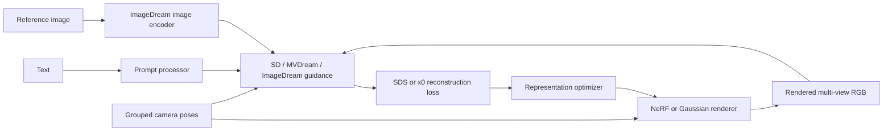

# MY_threestudio · Multimodal 3D Generation

**Text / image conditioning × NeRF / 3D Gaussian Splatting**

[한국어](README.ko.md) · [Installation](docs/INSTALL.md) · [Integration audit](docs/INTEGRATION.md) · [Fine-tuning](docs/FINETUNING.md) · [Validation](docs/VALIDATION.md)

A research integration based on [threestudio](https://github.com/threestudio-project/threestudio), combining SD guidance, MVDream and ImageDream with NeRF and Gaussian rendering. Sejun Hong describes the original work as part of NCSOFT Multimodal AI Lab research. This personal repository is not an official NCSOFT release.

The historical snapshot is commit `c894bfcaba28378aee5b7ec09e50f9b2b2516c6a` (2024-02-22). The later repair adds concrete integration fixes, a common launcher, focused tests and an experimental ImageDream adaptation script. [Contribution boundaries](docs/PORTFOLIO.ko.md).

## Pipeline matrix

| Entry point | Guidance | Representation | Conditioning |
|---|---|---|---|
| `sd-nerf` | Stable Diffusion SDS | NeRF | text |
| `mvdream-nerf` | pretrained MVDream | NeRF | text + camera |
| `mvdream-3dgs` | pretrained MVDream | 3DGS | text + camera |
| `imagedream-nerf` | pretrained/adapted ImageDream | NeRF | text + image + camera |
| `imagedream-3dgs` | pretrained/adapted ImageDream | 3DGS | text + image + camera |

MVDream/ImageDream configurations default to x0 reconstruction guidance (`recon_loss: true`); their alternative epsilon SDS branch is also repaired. These are separate selectable representations, not a NeRF-to-Gaussian conversion pipeline. The ImageDream cross-attention mechanism is provided by ImageDream; it is not claimed as a new attention architecture invented here.



## What was repaired

- Gaussian renderers return `[1,H,W,3]` backgrounds per view; the system retains all views as `[B,H,W,3]`.
- Shared background augmentation is evaluated over the full view batch. Both rasterizers use alpha composition so the background optimizer receives gradients.
- Manual backward uses Lightning's interface. Parameter updates precede densification; one step counter increment represents one rendered batch.
- ImageDream requires an actual reference image, preserves RGB background color, and aligns extra-view timesteps with grouped latents/context.
- Both multi-view guidance classes initialize the alpha schedule used by their SDS branch.
- Densification statistics persist in checkpoints; legacy checkpoint loading supplies missing statistics.
- Rasterizer output ABI is checked explicitly; non-square camera FoV uses image aspect ratio.

## Start here

For CPU regression checks only:

```bash
python -m pip install -r requirements-integration-tests.txt
PYTEST_DISABLE_PLUGIN_AUTOLOAD=1 python -m pytest -q
python scripts/run_pipeline.py --pipeline mvdream-3dgs --prompt "a ceramic corgi" --dry-run
python scripts/preflight.py
```

Actual training requires CUDA extensions and model weights. Follow [installation](docs/INSTALL.md), then run:

```bash
python scripts/run_pipeline.py --pipeline mvdream-3dgs --prompt "a ceramic corgi" --smoke
python scripts/run_pipeline.py --pipeline imagedream-3dgs \
  --prompt "a ceramic corgi" --image /path/to/reference.png \
  --checkpoint /path/to/sd-v2.1-base-4view-ipmv.pt \
  --model-config /path/to/sd_v2_base_ipmv.yaml --smoke
```

Remove `--smoke` for the full configured run. Override existing configuration values by appending, for example, `trainer.max_steps=1000`. Keep Gaussian runs single-GPU and FP32 while validating this repair. NeRF/DMTet refinement retains the original configurations and remains outside the new focused tests.

## Additional learning experiment

`scripts/finetune_multiview.py` adapts the cross-attention parameters of **pretrained ImageDream** using supervised four-view noise prediction. It does not reconstruct the user's historical fine-tuning experiment and does not train a multi-view model from vanilla SD. The output can be supplied as the ImageDream `--checkpoint` above. Dataset contract and limitations: [fine-tuning](docs/FINETUNING.md).

## Evidence and limits

Focused CPU tests exercise real function bodies with fake rasterization/diffusion backends. They establish tensor routing and gradient/order behavior, not real CUDA rendering or 3D quality. **No end-to-end GPU training, actual fine-tuning, view-consistency improvement or speedup has been measured in this repair.** See [validation](docs/VALIDATION.md) and the [experiment protocol](docs/EXPERIMENTS.md).

## Attribution

This repository depends on threestudio, MVDream, ImageDream, threestudio-3dgs and Gaussian rasterization work. Existing copyright headers and LICENSE are retained; component terms differ and are summarized in [THIRD_PARTY_NOTICES.md](THIRD_PARTY_NOTICES.md). Model weights, private infrastructure and internal NCSOFT datasets are not supplied.
